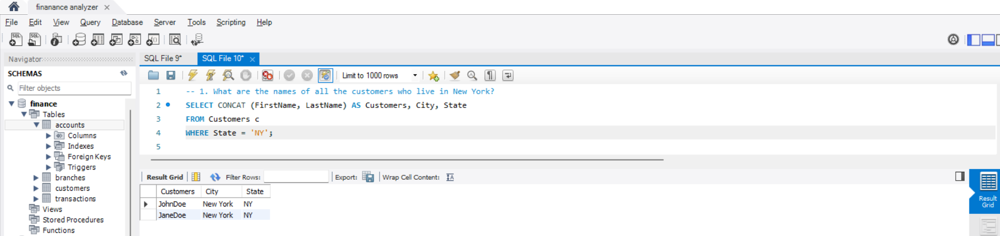
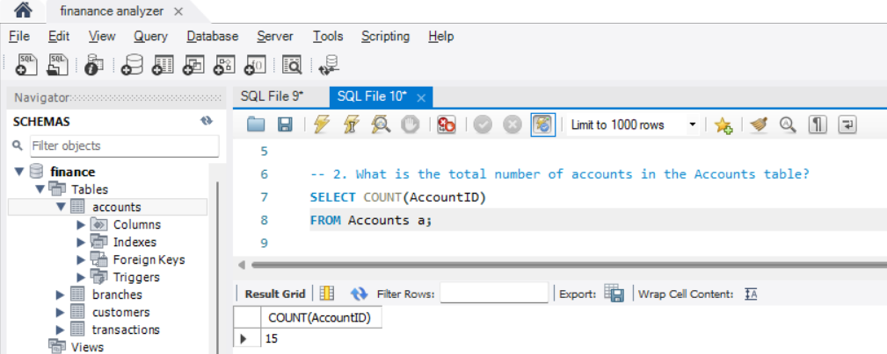
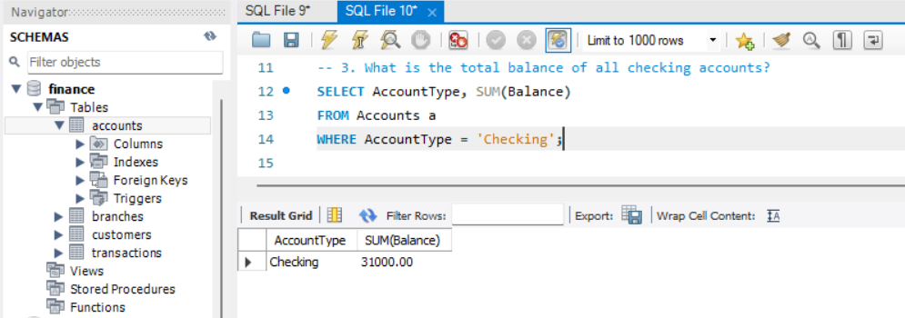
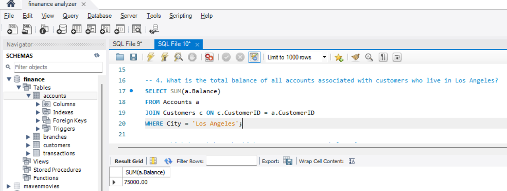
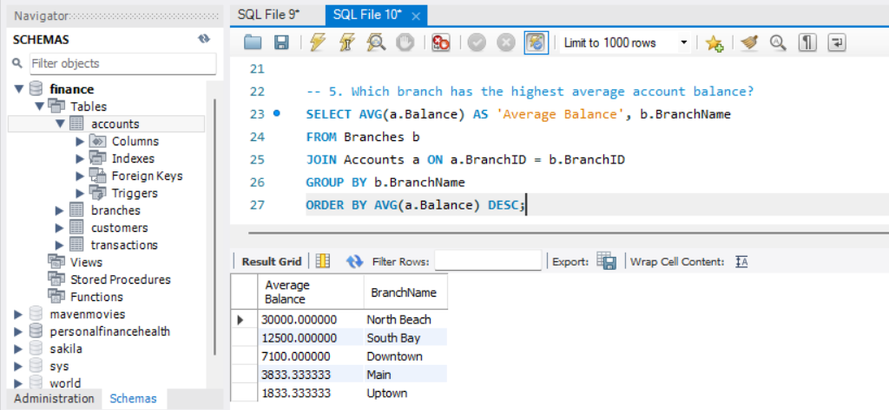
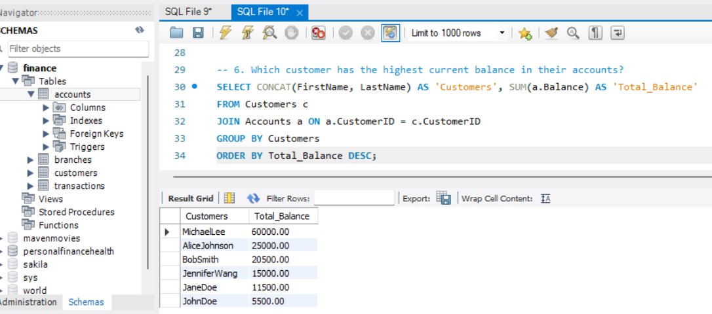
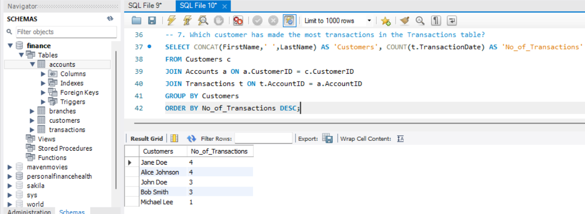
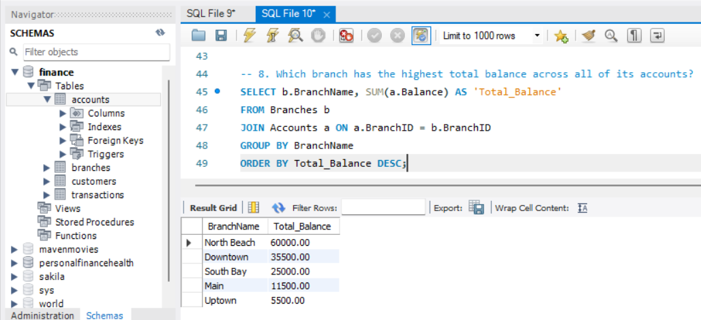
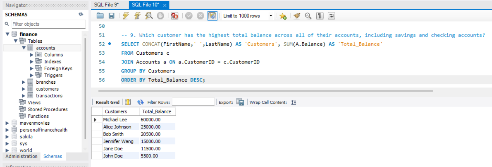
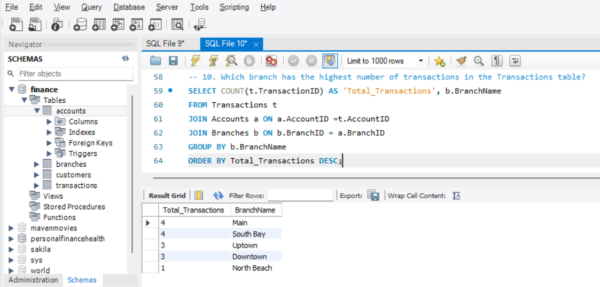

# The Big Bank Challenges-Finance-Analyser

## 📌 Intro :

A Finance Analyst working for 'The Big Bank' we have been tasked with finding out about our customers and their banking behaviour. Examine the accounts they hold and the type of transactions they make to develop greater insight into our customers.

## 🎯 Project Overview :

This project implements a banking database using SQL. It includes tables for Customers, Branches, Accounts, and Transactions, allowing for efficient management of banking operations such as account management, transactions, and branch operations.This supports business intelligence, risk management, and customer relationship management for an efficient banking system.

---

## **🏦 Bank Database Schema :** 
  
This schema represents a banking system, which includes:

🛒Customers:Customers who hold accounts.

📊 Branches:Branches where accounts are managed.

📈Accounts:Accounts of different types (Checking, Savings, Credit Card).

💸 Transactions: Transactions to track deposits, withdrawals, and payments.

---

  ## **🔍 Banking System Insights & Analysis :** 

🔄Identify customer demographics (location, accounts held).

🕒Track transaction history to understand spending habits.

📦Categorize customers by account type (Checking, Savings, Credit Card).

🎯Enhance targeted marketing campaigns for loans, offers, and credit cards.

---

  ## **💰 Revenue Enhancement :** 

💸Identify profitable account types (Savings accounts with high deposits).

🚀Analyze transaction trends for optimizing fees and interest rates.

💵Find top-earning branches based on deposits and transactions.

🎯Reduce non-performing accounts by targeting inactive customers.

---

 ## **⚙️ Operational Efficiency :** 

📦Optimize branch locations based on transaction volume.

🎯Identify low-balance accounts for engagement campaigns.

💸Improve fraud detection by tracking unusual transactions.

📈Automate account closures for long-inactive users.

---

 ## **🛠️ Tools & Technologies Used** :
- SQL – Data extraction, transformation, and querying
  

- BANK Database – Source of banks data

---

 ## 📊 **Insights & Expected Outcomes** :

✅ Customer segmentation for personalized banking services.

✅ Improved revenue by analyzing transaction patterns.

✅ Optimized operations for better banking efficiency.

✅ Enhanced fraud detection using transaction insights.

---

# 'The Big Bank' Data Queries

This repository contains SQL queries and corresponding visualizations for analyzing the bank dataset.

## Queries and Visualizations

### 1. What are the names of all the customers who live in New York?

### 2. What is the total number of accounts in the Accounts table?

### 3. What is the total balance of all checking accounts?

### 4. What is the total balance of all accounts associated with customers who live in Los Angeles?

### 5. Which branch has the highest average account balance?

### 6. Which customer has the highest current balance in their accounts?

### 7. Which customer has made the most transactions in the Transactions table?

### 8. Which branch has the highest total balance across all of its accounts?

### 9. Which customer has the highest total balance across all of their accounts, including savings and checking accounts?

### 10. Which branch has the highest number of transactions in the Transactions table?

